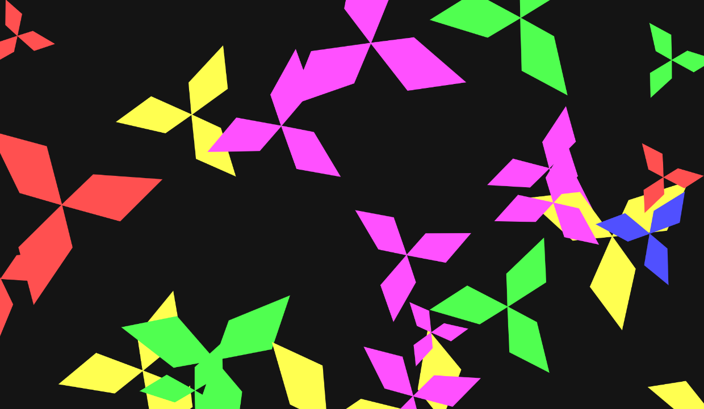
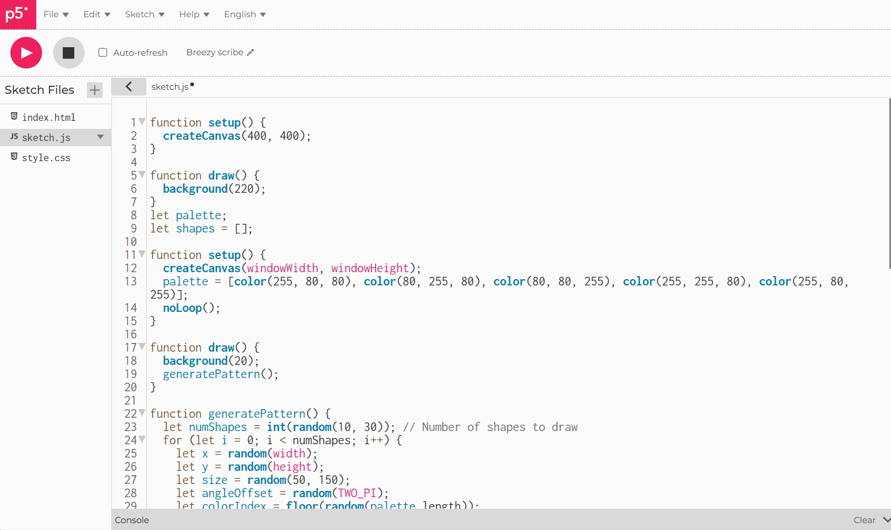
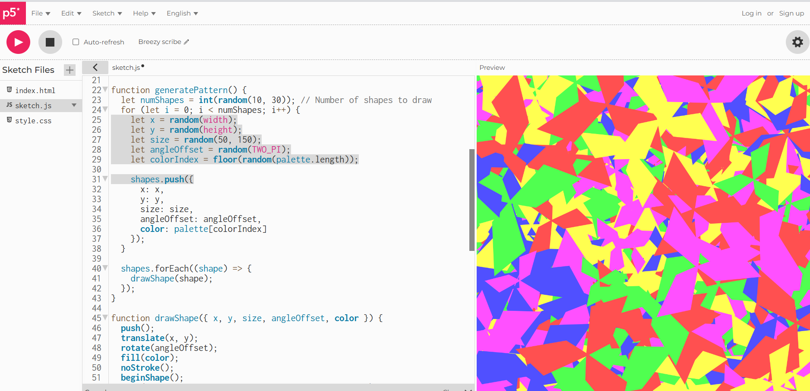

#### patrones visuales 

Con este código lo que se esta pidiendo es que haga unas figuras en puntos aleatorios, con colores aleatorios, tamaños aleatorios y que cada que se presiona la pantalla muestra otro patron de aleatoriedad gerenardo asi los patrones

**Insertar Código**:

``` js
function setup(){

}
```

``` py
def functionPy():

return 0
```
**Insertar un link**:

[Proyecto en el editor de p5.js](https://editor.p5js.org/juanitaduque/sketches/IR6Xew3kR)








